## DARP Optimal Initial Positions

Welcome to our project, a comprehensive Multi-Robot Coverage Path Planning module (mCPP) that leverages the DARP algorithm to efficiently cover an area of interest, taking into account predefined NoFly zones/obstacles within a designated grid. This implementation is designed to optimize initial positions for a team of mobile robots, specifically tailored for multi-UAV coverage missions.

### Key Features:

The foundation of our methodology already encompasses a suite of features aimed at maximizing the efficiency of individual paths. However, this project introduces an optimization procedure to further enhance performance:

1. **Shape Complexity Reduction:**
The optimization procedure minimizes the complexity of exclusive sub-regions, thereby reducing the number of turns required in the multi-robot solution.

2. **Energy and Time Efficiency:**
The algorithm not only streamlines path shapes but also improves energy and time efficiency for the entire multi-robot solution.

3. **Launch Points Optimization:**
Precise control of UAV launch points is implemented, suggesting ideal locations for setting up launching/docking stations for long-term coverage operations.

### Optimization Algorithm: Tree-Structured Parzen Estimator (TPE)

In the quest for optimal UAV launch points, the choice of an optimization algorithm is critical. After thorough consideration, we have selected the Tree-Structured Parzen Estimator (TPE) as our primary tool for this task.
Why TPE?

- **Efficiency Through Configuration:**
TPE dedicates more time to configuring and evaluating the most promising sets of input parameters, guided by insights gained from previous evaluations.

- **Versatility in Handling Parameters:**
TPE excels in handling various parameter types, including discrete parameters, a crucial aspect in our specific scenario.

- **Surrogate Function Utilization:**
TPE employs a surrogate function, a probabilistic representation of the objective function, constructed using information from previous evaluations. This aids in making informed decisions for optimal launch points, minimizing the number of turns in the mCPP mission.

This strategic use of TPE ensures a time-efficient and cost-effective convergence towards optimal launch points, making the mCPP objective more attainable with fewer iterations.

Thank you for exploring our project! If you have any questions or suggestions, feel free to reach out.

### **Requirements**
This project was created using:

    * Python version: 3.10.12
    * numpy: 1.26.2
    * matplotlib: 3.8.2
    * optuna: 2.0.0
    * opencv-python: 4.8.1.78
    * pygame: 2.5.2
    * scikit-learn: 1.3.2
    * numba: 0.58.1

### Installation and Running
#### To install the application, use:
```
git clone https://github.com/alice-st/DARP_Optimal_Initial_Positions.git --recurse-submodules
cd DARP_Optimal_Initial_Positions
./requirements.sh darp-venv 
. darp-venv/bin/activate
```

#### To run the application, use:

```
python3 darp_x_optuna.py
```

### Usage

By default, without defining any parameters, the darp_x_optuna is going to run for the following setup:

**Grid Dimensions:** 10 10
**Robot Number:** 3
**Portions for each Robot:** [0.3, 0.3, 0.3] 

The optimization results, inluding the optimal initial positions for the robots, can be found under the directory DARP_Optimal_Initial_Positions/Results/

To define specific parameters please use the instructions below:

#### To modify the Grid Dimensions, use:
```
python3 darp_x_optuna.py -grid x y

```
where x, y are the desired rows and columns of the Grid respectively (default: 10, 10).

#### To modify the number of Robots, use:

```
python3 darp_x_optuna.py -num_drones k
```
where k is the desired number of robots (default: 3).

#### To assign different portions to each Robot (not Equal), use:


```
python3 darp_x_optuna.py -nep -portions p_a p_b p_c

```

where p_a p_b p_c are the portions assigned to Robots a, b and c respectively. Their sum should be equal to 1. (default: 0.2, 0.3, 0.5)

If -nep is activated (set to True), the algorithm runs for not equal territories with 20%, 30% and 50% coverage per robot. Otherwise, the algorithm runs for equal territories with 33,33% coverage per robot. 


#### To use different positions for the obstacles in the Grid, use:

```
python3 darp_x_optuna.py -obs_pos o1 o2 o3
```

where o1 o2 and o3 are the positions of the obstacles in the Grid. Obstacle positions should not overlap with Robots' initial positions. (default: 5, 6, 7) (row=0,column=0 --> cell=0, row=0,column=1 --> cell=1 etc.)

#### To visualize the final optimization results, use:

```
python3 darp_x_optuna.py -vis
```

#### To modify the total number of optimization trials, use:

```
python3 darp_x_optuna.py -number_of_trials num_trials
```

where num_trials is the desired number of optimization trials (default: 200).

#### Demo example:
 
 ```
python3 darp_x_optuna.py -vis -nep -obs_pos 10 11 12 21 22 23 33 34 35 45 46 47 57 -num_drones 3 -portions 0.7 0.2 0.1 -number_of_trials 300
```

## Optimization Results

### Grid Dimensions: 15x20, Number of Drones: 3, Without Obstacles

| Optimized Paths | Random Paths |
| ----------------------------------- | ----------------------------------- |
| 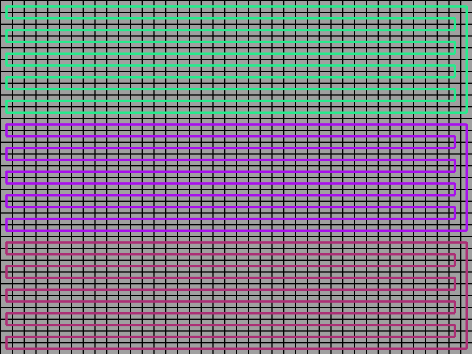 | 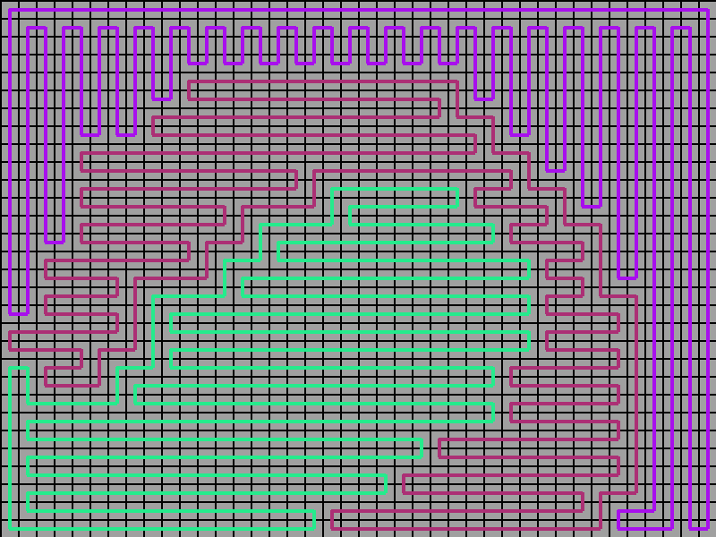 |


### Grid Dimensions: 15x20, Number of drones: 3, With Obstacles

| Optimized Paths | Random Paths |
| ----------------------------------- | ----------------------------------- |
| 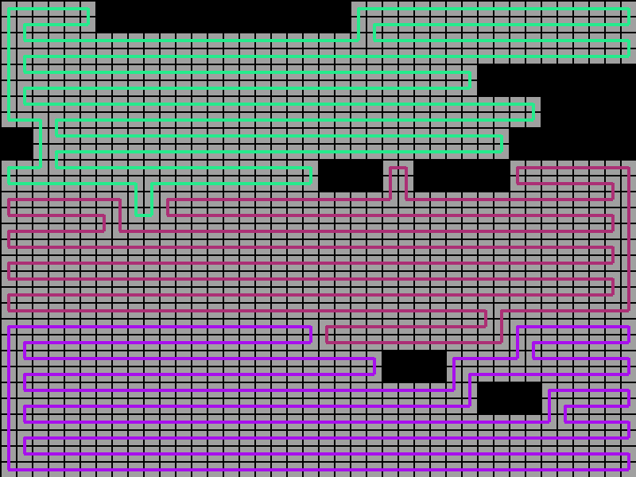 | 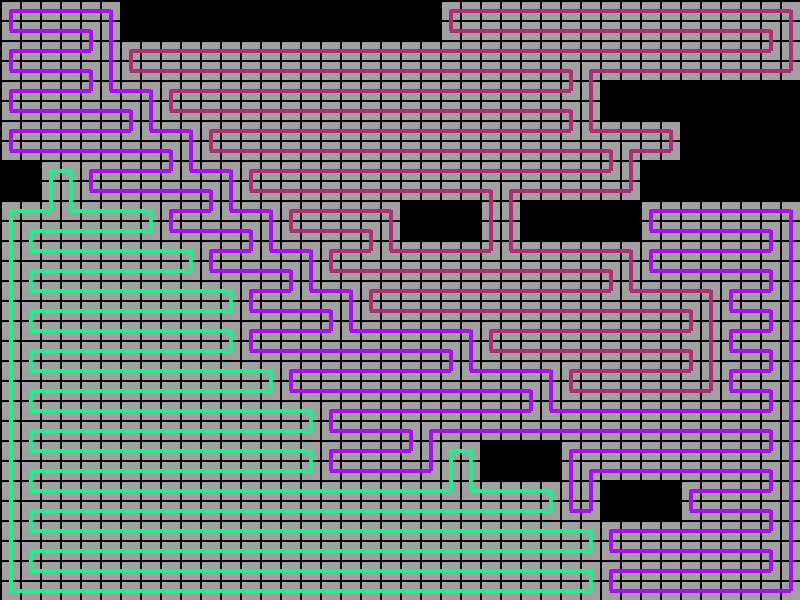 |


### Grid Dimensions: 20x20, Number of drones: 6, Without Obstacles

| Optimized Paths | Random Paths |
| ----------------------------------- | ----------------------------------- |
| 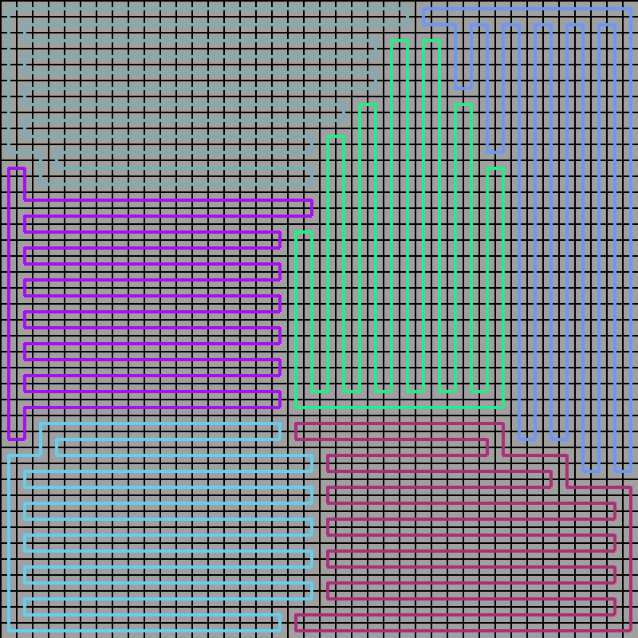 | 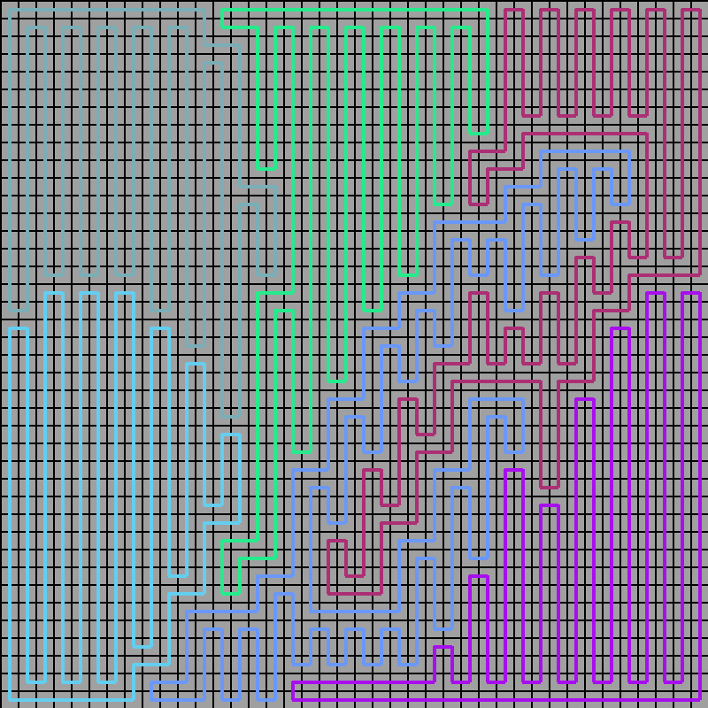 |


### Grid Dimensions: 20x20, Number of drones: 6, With Obstacles

| Optimized Paths | Random Paths |
| ----------------------------------- | ----------------------------------- |
| 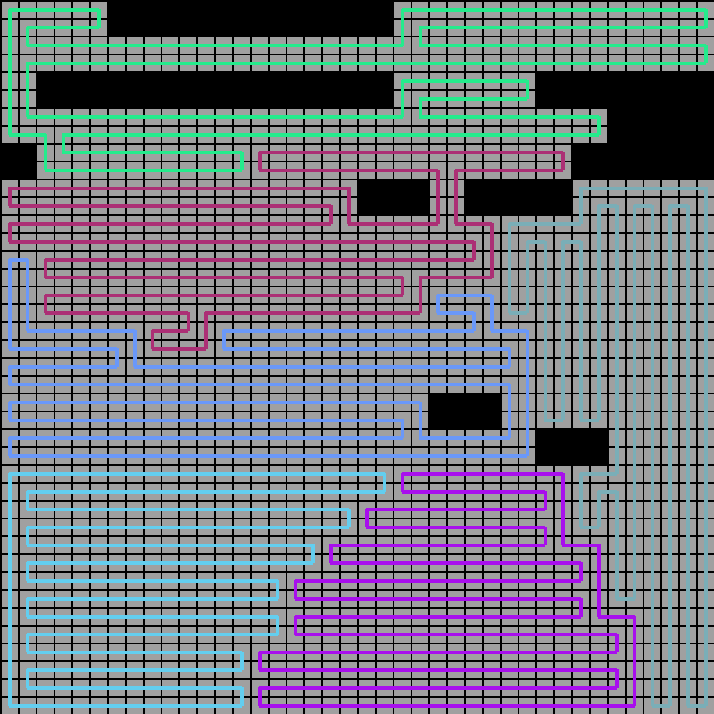 | 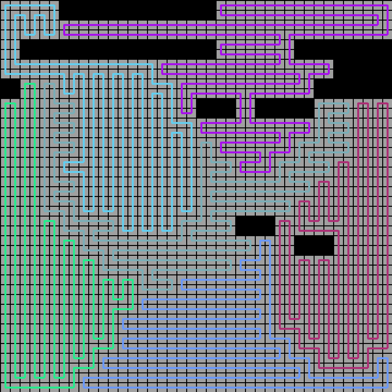 |


### Grid Dimensions: 20x20, Number of drones: 9, Without Obstacles

| Optimized Paths | Random Paths |
| ----------------------------------- | ----------------------------------- |
| 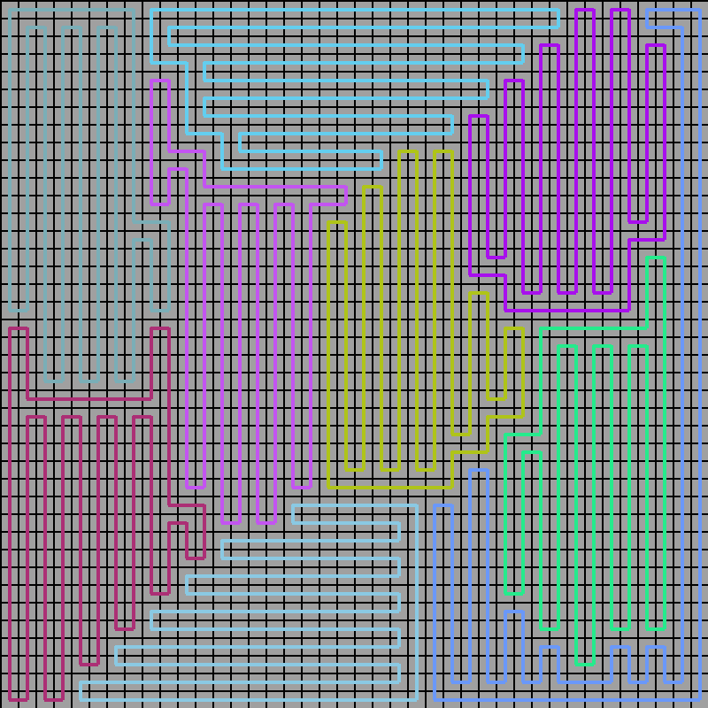 | 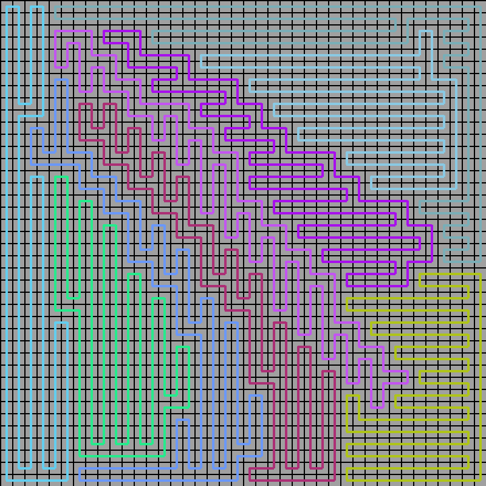 |


### Grid Dimensions: 20x20, Number of drones: 9, With Obstacles

| Optimized Paths | Random Paths |
| ----------------------------------- | ----------------------------------- |
| 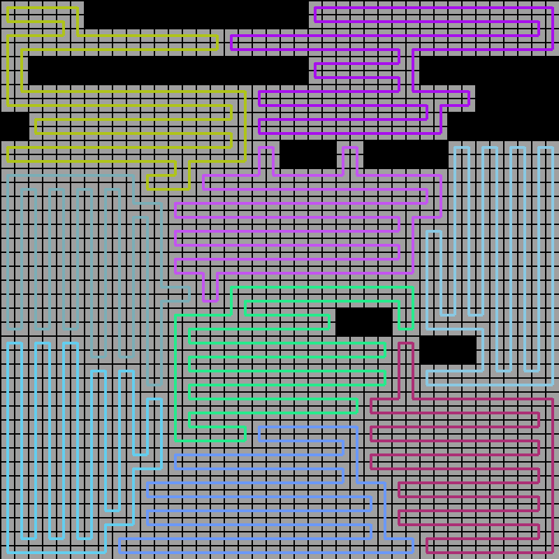 | 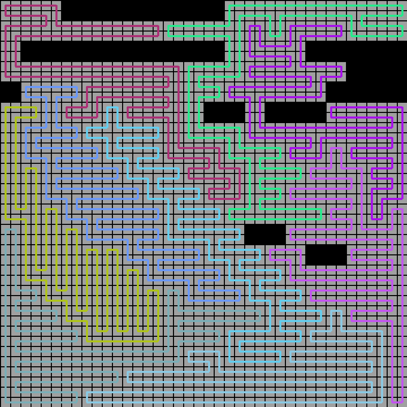 |


## License

Distributed under the MIT License. See [LICENSE](https://github.com/alice-st/DARP_Optimal_Initial_Positions/tree/main/LICENSE) for more information.

## Acknowledgments

This project has received funding from the European Commission under the European Union's Horizon 2020 research and innovation programme under grant agreement no 883302 (ISOLA).

## Contributors

- Aliki Stefanopoulou - [github](https://github.com/alice-st) - aliki.stefano@gmail.com
- Emmanuel K. Raptis - [github](https://github.com/emmarapt) - emmarapt@iti.gr
- Savvas Apostolidis- [github](https://github.com/savvas-ap) - sapostol@ee.duth.gr
- Socratis Gkelios- [github](https://github.com/soc12) - sgkelios@ee.duth.gr
- Athanasios Ch. Kapoutsis - [github](https://github.com/athakapo) - athakapo@iti.gr

## Cite As

@article{article,
author = {Stefanopoulou, Aliki and Raptis, Emmanuel K. and Apostolidis, Savvas and Gkelios, Socratis and Kapoutsis, Athanasios and Chatzichristofis, Savvas and Vrochidis, Stefanos and Kosmatopoulos, Elias},
year = {2024},
month = {04},
pages = {1-19},
title = {Improving time and energy efficiency in multi-UAV coverage operations by optimizing the UAVs’ initial positions},
journal = {International Journal of Intelligent Robotics and Applications},
doi = {10.1007/s41315-024-00333-2}
}
